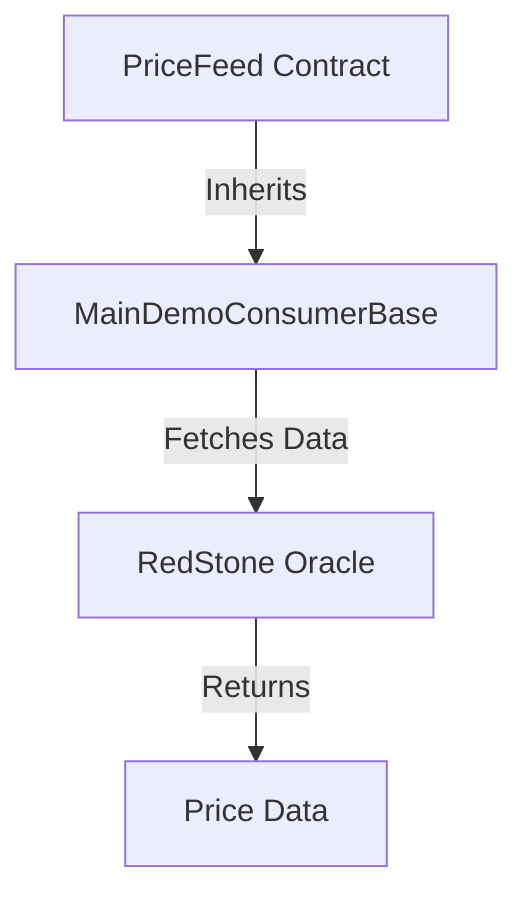
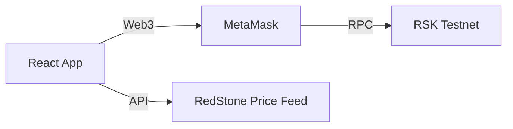

# RedStone Price Feed DApp - Technical Documentation

## Architecture Overview

### Smart Contract Layer
The smart contract layer consists of a Solidity contract that inherits from RedStone's `MainDemoConsumerBase` to access price feed data.



### Frontend Layer
The frontend is built using React and communicates with both the blockchain and RedStone's API.



## Smart Contract Details

### PriceFeed.sol

```solidity
// SPDX-License-Identifier: MIT
pragma solidity ^0.8.19;

import "@redstone-finance/evm-connector/contracts/data-services/MainDemoConsumerBase.sol";

contract PriceFeed is MainDemoConsumerBase {
    function getEthPrice() public view returns (uint256) {
        return getOracleNumericValueFromTxMsg(bytes32("ETH"));
    }

    function getBtcPrice() public view returns (uint256) {
        return getOracleNumericValueFromTxMsg(bytes32("BTC"));
    }

    function getRbtcPrice() public view returns (uint256) {
        return getOracleNumericValueFromTxMsg(bytes32("RBTC"));
    }

    function getRifPrice() public view returns (uint256) {
        return getOracleNumericValueFromTxMsg(bytes32("RIF"));
    }
}
```

#### Key Functions
- `getEthPrice()`: Fetches ETH/USD price
- `getBtcPrice()`: Fetches BTC/USD price
- `getRbtcPrice()`: Fetches RBTC/USD price
- `getRifPrice()`: Fetches RIF/USD price

#### Security Considerations
- View functions only
- Relies on RedStone's secure oracle infrastructure
- No state modifications
- No access control needed

## Frontend Technical Details

### State Management
```typescript
const [ethPrice, setEthPrice] = useState<string>('0');
const [btcPrice, setBtcPrice] = useState<string>('0');
const [rbtcPrice, setRbtcPrice] = useState<string>('0');
const [rifPrice, setRifPrice] = useState<string>('0');
const [loading, setLoading] = useState<boolean>(false);
const [error, setError] = useState<string>('');
const [isConnected, setIsConnected] = useState<boolean>(false);
const [contractAddress, setContractAddress] = useState<string>('');
const [account, setAccount] = useState<string>('');
```

### Web3 Integration
```typescript
const provider = new providers.Web3Provider(window.ethereum);
const signer: Signer = provider.getSigner();
const contract = new Contract(contractAddress, contractABI, signer);
```

### Price Feed Integration
The application fetches prices directly from RedStone's API:
```typescript
const [ethPriceResponse, btcPriceResponse, rbtcPriceResponse, rifPriceResponse] = await Promise.all([
  fetch('https://api.redstone.finance/prices?symbol=ETH&provider=redstone&limit=1'),
  fetch('https://api.redstone.finance/prices?symbol=BTC&provider=redstone&limit=1'),
  fetch('https://api.redstone.finance/prices?symbol=RBTC&provider=redstone&limit=1'),
  fetch('https://api.redstone.finance/prices?symbol=RIF&provider=redstone&limit=1')
]);
```

### Error Handling
```typescript
try {
  // Operation code
} catch (err) {
  const error = err as Error;
  setError(error.message);
  toast({
    title: 'Error',
    description: error.message,
    status: 'error',
    duration: 5000,
    isClosable: true,
  });
}
```

## API Endpoints

### RedStone API
- Base URL: `https://api.redstone.finance`
- Endpoints:
  - `/prices`: Get current prices
    - Parameters:
      - `symbol`: Token symbol (e.g., "ETH", "BTC", "RBTC", "RIF")
      - `provider`: Data provider (e.g., "redstone")
      - `limit`: Number of results

## Development Environment Setup

### Required Tools
- Node.js and npm
- Hardhat for smart contract development
- MetaMask for wallet interaction
- Git for version control

### Environment Variables
```env
# Contract Deployment
PRIVATE_KEY=your_private_key_here

# Frontend (if needed)
VITE_CONTRACT_ADDRESS=deployed_contract_address
```

### Development Commands

#### Smart Contract Development
```bash
# Compile contracts
npx hardhat compile

# Run tests
npx hardhat test

# Deploy to testnet
npx hardhat run scripts/deploy.js --network rsktestnet
```

#### Frontend Development
```bash
# Start development server
npm run dev

# Build for production
npm run build

# Run tests
npm test
```

## Testing Strategy

### Smart Contract Tests
- Unit tests for price feed functions
- Integration tests with RedStone oracle
- Gas optimization tests

### Frontend Tests
- Component rendering tests
- Web3 integration tests
- API integration tests
- Error handling tests

## Performance Considerations

### Smart Contract
- View functions are gas-efficient
- No state storage requirements
- Minimal computational overhead

### Frontend
- Debounced price updates
- Efficient error handling
- Responsive UI updates

## Deployment Process

### Smart Contract Deployment
1. Configure environment variables
2. Compile contracts
3. Deploy to RSK Testnet
4. Verify contract on block explorer

### Frontend Deployment
1. Build production bundle
2. Configure environment variables
3. Deploy to hosting service
4. Verify functionality

## Monitoring and Maintenance

### Smart Contract Monitoring
- Monitor oracle data feeds
- Track gas usage
- Watch for contract events

### Frontend Monitoring
- Track API response times
- Monitor error rates
- User interaction analytics

## Upgrade Strategy

### Smart Contract Upgrades
- Non-upgradeable contract design
- New deployment required for updates
- Clear migration path needed

### Frontend Upgrades
- Progressive enhancement
- Backward compatibility
- Feature flags for new functionality

## Security Considerations

### Smart Contract Security
- No admin functions
- View-only operations
- Oracle data validation

### Frontend Security
- Input validation
- Secure API calls
- Error boundary implementation
- MetaMask security best practices

## Troubleshooting Guide

### Common Contract Issues
1. Oracle data not available
   - Check RedStone service status
   - Verify contract deployment

2. Transaction failures
   - Check gas price
   - Verify network status

### Common Frontend Issues
1. MetaMask connection
   - Network configuration
   - Account permissions

2. Price feed issues
   - API availability
   - Data format validation

## Future Improvements

1. Technical Enhancements
   - WebSocket integration for real-time updates
   - Caching layer for price data
   - Performance optimizations

2. Feature Additions
   - Additional price pairs
   - Historical price data
   - Price alerts

## Support and Resources

### Documentation
- [RedStone Documentation](https://docs.redstone.finance/)
- [RSK Documentation](https://developers.rsk.co/)
- [React Documentation](https://reactjs.org/docs)

### Community
- GitHub Issues
- Discord Community
- Technical Support

## Version History

### v1.1.0
- Added RBTC and RIF price feeds
- Improved UI with responsive layout
- Enhanced error handling
- Updated documentation

### v1.0.0
- Initial release
- Basic price feed functionality
- MetaMask integration
- RSK Testnet support 